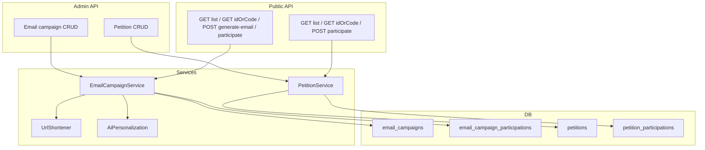

# Email Campaign & Petition — Implementation Plan (Revised)

## Design decisions (from discussion)

- **Petition and Email Campaign are fully separate:** different tables, different API prefixes, no shared `type` column. Easier to evolve and reason about.
- **No userId dependency for public flows:** visitors do not need to log in. AI email content is generated on each request and returned to the frontend (no per-user stored versions). Participation (if any) is tracked by anonymous session (e.g. cookie) or IP, not by `users.id`.
- **AI email: stateless:** no table for per-user email versions; one endpoint that takes campaign id, calls AI with subject_base/body_base, returns `{ subject, body }`. Frontend can call again for a new variant; optional rate limit by IP/session to prevent abuse.
- **Admin only:** Campaign and petition CRUD require auth (admin or permission); public endpoints for listing/viewing/participating and for generating email content do not require a logged-in user.

## Scope and placement

- **Where:** Same backend as core-system ([backend/core-system](backend/core-system)): same DB, same Express app.
- **Auth:** Admin endpoints use `requirePermission(PERMISSIONS.EMAIL_CAMPAIGN)` or `requireAdmin` ([src/utils/permissions.ts](backend/core-system/src/utils/permissions.ts)). Public endpoints (list, by-code, view, generate-email, participate) use no auth or optional session for participation; no `user_id` in any of the new public-facing tables.
- **API prefixes:** `/v1/email-campaigns` and `/v1/petitions` (separate resources).

---

## Part A: Email Campaigns (standalone)

### A.1 Database schema (email campaigns only)

All primary and foreign keys use **UUID** (e.g. `gen_random_uuid()`), consistent with [src/db/schema.ts](backend/core-system/src/db/schema.ts) (users, co_hosts).

- **email_campaigns**  
  `id` UUID PRIMARY KEY DEFAULT gen_random_uuid(), `title` VARCHAR(255) NOT NULL, `description` TEXT, `link` TEXT (shortened mailto: to + bcc only), `expires_at` TIMESTAMP, `is_active` BOOLEAN DEFAULT TRUE, `email_to` TEXT NOT NULL, `email_bcc` TEXT, `subject_base` TEXT, `body_base` TEXT, `direct_link_code` VARCHAR(24) UNIQUE NOT NULL, `created_at` TIMESTAMP DEFAULT NOW().

- **email_campaign_attachments** (optional)  
  `id` UUID PRIMARY KEY DEFAULT gen_random_uuid(), `campaign_id` UUID NOT NULL REFERENCES email_campaigns(id) ON DELETE CASCADE, `file_path` TEXT, `display_order` INTEGER DEFAULT 0, `created_at` TIMESTAMP DEFAULT NOW().

- **email_campaign_participations** (optional, no user_id)  
  For simple count / dedup by session. Example: `id` UUID PRIMARY KEY DEFAULT gen_random_uuid(), `campaign_id` UUID NOT NULL REFERENCES email_campaigns(id) ON DELETE CASCADE, `session_id` VARCHAR(64) NOT NULL (or `ip_hash`), `participated_at` TIMESTAMP DEFAULT NOW(), UNIQUE(campaign_id, session_id).  
  No reference to `users` table. If you prefer no participation tracking at all, omit this table and do not expose a count.

No table for per-user email versions; AI is stateless.

### A.2 Direct link code and mailto

- **Direct link code:** Util (e.g. `src/utils/directLinkCode.ts`): generate 10–12 URL-safe chars; on insert retry until unique.
- **Mailto:** Helper `buildMailto(to: string, bcc?: string): string` → `mailto:to?bcc=...` (no subject/body). Built once at campaign create, then shortened and stored in `email_campaigns.link`.

### A.3 URL shortener

- Interface `shortenUrl(longUrl: string): Promise<string>`; one implementation (e.g. Short.io, Bitly) via env; on failure return original URL. Used when creating an email campaign to set `link`.

### A.4 AI personalization (stateless)

- Interface `generatePersonalizedEmail(subjectBase: string, bodyBase: string): Promise<{ subject: string; body: string }>`.
- One provider (OpenAI, Gemini, Groq) via env; temperature ~0.7–0.8; plain text; return JSON `{ subject, body }`.
- No DB storage: each request to the endpoint runs AI and returns result. Optional rate limit per IP or per session to avoid abuse.

### A.5 Repositories and services (email campaigns)

- **EmailCampaignRepository:** CRUD for `email_campaigns`; `findByIdOrCode(idOrCode)` (try by UUID then by direct_link_code); `list(activeOnly?)` for admin, list active-only for public; optional participation count. Create: validate email_to, build mailto, shorten, set link, generate direct_link_code, insert.
- **EmailCampaignParticipationRepository** (optional): `record(campaignId, sessionId)` idempotent; optional `countByCampaignId(campaignId)`.
- **EmailCampaignService:** Orchestrates repo + shortener + AI. Admin: create, list, getById, update, delete. Public: list (active only), getByIdOrCode (single lookup by id or direct_link_code); generate-email; participate (session-based if table exists).

### A.6 REST API (email campaigns)

- **Admin** (requireAuth + requirePermission('email_campaign') or requireAdmin):
  - `POST /v1/email-campaigns` — body: title, description?, email_to, email_bcc?, subject_base?, body_base?, expires_at?, is_active?. Build mailto, shorten, set link; generate direct_link_code. Response: `id`, `direct_link_code`, `link`, ...
  - `GET /v1/email-campaigns` — query `active_only`?; list with optional participation_count.
  - `GET /v1/email-campaigns/:id`
  - `PATCH /v1/email-campaigns/:id` — e.g. is_active, expires_at, title, description.
  - `DELETE /v1/email-campaigns/:id`

- **Public** (no auth for read; optional session for participate):
  - `GET /v1/email-campaigns` — list: returns only active and not-expired campaigns (no `/active` in URL; backend filters by state).
  - `GET /v1/email-campaigns/:idOrCode` — **unified lookup:** backend resolves by UUID (id) or by `direct_link_code`; if param looks like UUID, try by id first, else try by code. Return 404 if not found or inactive/expired. Response: campaign payload (link, email_to, email_bcc, subject_base, body_base).
  - `POST /v1/email-campaigns/:idOrCode/generate-email` — same resolution for :idOrCode; then call AI, return `{ subject, body }`. Optional rate limit.
  - `POST /v1/email-campaigns/:idOrCode/participate` — same resolution; idempotent record by session_id or skip.

No separate `/active` or `/by-code/:code` routes; one list and one lookup that accepts either id or code.

---

## Part B: Petitions (standalone)

### B.1 Database schema (petitions only)

All primary and foreign keys use **UUID**, same as email campaigns.

- **petitions**  
  `id` UUID PRIMARY KEY DEFAULT gen_random_uuid(), `title` VARCHAR(255) NOT NULL, `description` TEXT, `link` TEXT NOT NULL (action URL), `direct_link_code` VARCHAR(24) UNIQUE NOT NULL, `expires_at` TIMESTAMP, `is_active` BOOLEAN DEFAULT TRUE, `created_at` TIMESTAMP DEFAULT NOW().

- **petition_attachments** (optional)  
  `id` UUID PRIMARY KEY DEFAULT gen_random_uuid(), `petition_id` UUID NOT NULL REFERENCES petitions(id) ON DELETE CASCADE, `file_path` TEXT, `display_order` INTEGER DEFAULT 0, `created_at` TIMESTAMP DEFAULT NOW().

- **petition_participations** (optional, no user_id)  
  Same idea as email campaign: `id` UUID PRIMARY KEY DEFAULT gen_random_uuid(), `petition_id` UUID NOT NULL REFERENCES petitions(id) ON DELETE CASCADE, `session_id` VARCHAR(64) NOT NULL (or `ip_hash`), `participated_at` TIMESTAMP DEFAULT NOW(), UNIQUE(petition_id, session_id). Or omit and do not track.

No email fields, no mailto, no AI.

### B.2 Direct link code

- Reuse same util as email campaigns; generate unique code on petition create.

### B.3 Repositories and services (petitions)

- **PetitionRepository:** CRUD for `petitions`; `findByIdOrCode(idOrCode)` (try by UUID then by direct_link_code); `list(activeOnly?)` for admin, list active-only for public; optional participation count.
- **PetitionParticipationRepository** (optional): same pattern as email campaign participation (session-based).
- **PetitionService:** Admin: create, list, getById, update, delete. Public: list (active only), getByIdOrCode; participate (optional, by session).

### B.4 REST API (petitions)

- **Admin** (requireAuth + requirePermission('email_campaign') or requireAdmin — or introduce PERMISSIONS.PETITION if you want separate permission):
  - `POST /v1/petitions` — body: title, description?, link, expires_at?, is_active?. Generate direct_link_code. Response: `id`, `direct_link_code`, `link`, ...
  - `GET /v1/petitions` — query `active_only`?
  - `GET /v1/petitions/:id`
  - `PATCH /v1/petitions/:id`
  - `DELETE /v1/petitions/:id`

- **Public:**
  - `GET /v1/petitions` — list: returns only active and not-expired petitions (no `/active` in URL).
  - `GET /v1/petitions/:idOrCode` — **unified lookup:** resolve by UUID (id) or by `direct_link_code`; return 404 if not found or inactive/expired.
  - `POST /v1/petitions/:idOrCode/participate` — same resolution; optional; idempotent by session.

No separate `/active` or `/by-code/:code`; one list and one lookup by id or code.

---

## Part C: Shared / integration

### C.1 Entry points and Swagger

- **Full app** ([app.ts](backend/core-system/src/app.ts)): mount both `/v1/email-campaigns` and `/v1/petitions` (admin + public routes).
- **Public entry** ([app-public.ts](backend/core-system/src/app-public.ts)): mount only public routes for both (GET list, GET :idOrCode, POST :idOrCode/participate, and for campaigns POST :idOrCode/generate-email).
- **Private entry** ([app-private.ts](backend/core-system/src/app-private.ts)): mount only admin routes for both.
- **Swagger:** Tags e.g. "Email Campaigns – Admin", "Email Campaigns – Public", "Petitions – Admin", "Petitions – Public". Update [swaggerSpecByEntry.ts](backend/core-system/src/utils/swaggerSpecByEntry.ts) so public entry shows campaign + petition public paths, private shows admin paths.

### C.2 Errors and config

- Add to [src/errors.ts](backend/core-system/src/errors.ts): e.g. `CAMPAIGN_NOT_FOUND`, `PETITION_NOT_FOUND`, `PERSONALIZATION_FAILED`, `SHORTENER_FAILED` (or reuse NOT_FOUND with details).
- Config: add optional `URL_SHORTENER_*`, `AI_*`; document in [.env.example](backend/core-system/.env.example).

### C.3 Permissions

- Option A: Keep single permission `PERMISSIONS.EMAIL_CAMPAIGN` for both email campaigns and petitions admin.
- Option B: Add `PERMISSIONS.PETITION` and gate petition admin routes with it; email campaign admin stays with `EMAIL_CAMPAIGN`. Plan assumes Option A unless you prefer splitting.

---

## Implementation order (suggested)

1. **Shared:** Direct link code util; config/env for shortener and AI.
2. **Email campaigns:** Schema (email_campaigns, email_campaign_attachments, optional email_campaign_participations); mailto helper; URL shortener (interface + one impl); AI personalization (interface + one impl); EmailCampaignRepository (and optional participation repo); EmailCampaignService; admin + public routes; wire into app / app-public / app-private.
3. **Petitions:** Schema (petitions, optional petition_attachments, optional petition_participations); PetitionRepository (and optional participation repo); PetitionService; admin + public routes; wire into app / app-public / app-private.
4. Swagger tags and filter by entry; error codes; .env.example.

---

## Implementation notes (for coding)

Use these when implementing so behavior and edge cases are consistent.

### List: same path, behavior by auth

- **GET /v1/email-campaigns** and **GET /v1/petitions** are the same path for both admin and public.
- Inside the handler: if the request has admin auth (requirePermission/requireAdmin passed), list with optional query `active_only` (admin can see all or filter). If no admin auth (public), always return only active and not-expired items. No separate route for `/active`.

### Resolving :idOrCode

- Use a single path param **:idOrCode** for GET one, PATCH, DELETE, and for POST …/participate and …/generate-email.
- **Resolution:** if `idOrCode` matches UUID format (e.g. regex for `xxxxxxxx-xxxx-4xxx-yxxx-xxxxxxxxxxxx`), call `findById(idOrCode)` first; otherwise call `findByDirectLinkCode(idOrCode)`. Return 404 if not found. For public GET, also return 404 if the item is inactive or expired.
- **Admin PATCH/DELETE:** use the same resolution (same param :idOrCode and same `findByIdOrCode`), so admin can use either UUID or direct_link_code. One route pattern for all.

### Session for participation (optional)

- If you keep participation tables, identify the visitor by a **session id** (e.g. UUID) so the same browser is not double-counted.
- **Source:** cookie (e.g. `session_id=…`) or header (e.g. `X-Session-Id`). Choose one; document in API.
- **When missing:** either (a) create a new session id, set it in response cookie, and use it for the participation row, or (b) return 400 if participate is called without session. Prefer (a) for better UX.
- Cookie options: HttpOnly, SameSite=Lax (or Strict), path=/, max-age as needed. No need to tie this to users table.

### Rate limit for generate-email

- **Optional but recommended:** apply a rate limit on **POST /v1/email-campaigns/:idOrCode/generate-email** to avoid abuse (e.g. by IP or by session id).
- Example: e.g. 10–20 requests per minute per IP (or per session). Use a small middleware (e.g. express-rate-limit or custom) only on this route. When limit exceeded, return 429 with a clear message.

### Validation

- **:idOrCode** in route: accept non-empty string; resolution (UUID vs code) is done in service/repo. No need to validate UUID format in route validator if you resolve both ways.
- Admin body (POST/PATCH): validate required fields (e.g. email_to for campaign create, link for petition create) and types; use existing express-validator pattern from [routes/admin/coHosts.ts](backend/core-system/src/routes/admin/coHosts.ts).

---

## Diagram (high-level)

---

## Summary table

| Topic | Email campaigns | Petitions |
|-------|-----------------|-----------|
| IDs | UUID (id, campaign_id FKs) | UUID (id, petition_id FKs) |
| Tables | email_campaigns, email_campaign_attachments, optional email_campaign_participations | petitions, optional petition_attachments, optional petition_participations |
| API prefix | /v1/email-campaigns (list + :idOrCode for get/actions) | /v1/petitions (list + :idOrCode for get/participate) |
| User dependency | None (stateless AI; optional session-based participation) | None (optional session-based participation) |
| AI | Generate on request; return to frontend; no DB storage | Not used |
| Link | Shortened mailto (to + bcc only) | Single action URL (no shortening required unless desired) |
| Direct link code | Unique per campaign | Unique per petition |

This plan reflects full separation of petition and email campaign (tables and APIs), no userId for public flows, and stateless AI email generation.
